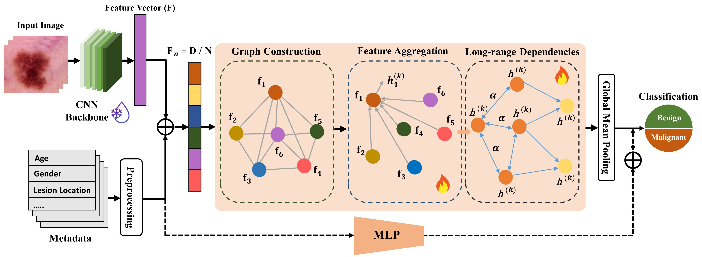

# Context-Aware Graph Neural Network for Skin Lesion Classification

<p align="left">
  <a href="https://dl.acm.org/doi/proceedings/10.1145/3748522" target="_blank" rel="noopener noreferrer"></a>
  <a href="https://doi.org/10.1145/3748522.3779958" target="_blank" rel="noopener noreferrer"></a>
  <a href="https://github.com/azeemchaudharyg/C-GNN/blob/main/notebooks/GNN_Multimodal.ipynb" target="_blank" rel="noopener noreferrer"></a>
  <a href="#" target="_blank" rel="noopener noreferrer"></a>
</p>

Official repository accompanying the paper: **"Context-Aware Graph Neural Network for Skin Lesion Classification"** 

**Authors:** Muhammad Azeem, Saqib Nazir, Amr Ahmed, and Ardhendu Behera  

**Institution:** Edge Hill University, Ormskirk, Lancashire, UK 

---

## Abstract
The accurate classification of skin lesions, particularly melanoma, is vital for the early detection and effective treatment of skin cancer. Although deep learning models such as convolutional neural networks (CNNs) have achieved remarkable success in dermoscopic image analysis, they often overlook valuable structured metadata (e.g., patient demographics, lesion location, and type) that provide essential diagnostic context. We present a graph-driven multimodal framework that jointly models visual and metadata information for skin lesion classification. Our approach uses a frozen CNN backbone to extract deep visual representations via dual pooling (mean and max), which are concatenated with encoded metadata and partitioned into subspaces. These subspaces are treated as nodes within a graph, where a graph neural network (GNN) captures intra-sample dependencies between feature subspaces and clinical attributes to refine lesion representations. Experiments on four public benchmarks: ISIC2024, HAM10000, PAD-UFES-20, and HIBA, demonstrate consistent performance gains over several state-of-the-art (SOTA) approaches, with relative accuracy improvements ranging from +0.5% to +8.8% across datasets. The results highlight the potential of graph-based modeling of metadata and image features to build more robust and clinically informed skin cancer classifiers.

---

## Key Contributions
* **Graph-Driven Multimodal Fusion:** Introduces a novel framework that integrates CNN-derived visual subspaces and clinical patient metadata into a unified graph, propagating context-aware features for more discriminative lesion representation.

* **Inductive GNN Formulation:** Employs a principled feature-to-graph transformation via systematic subspace partitioning, backed by an inductive message-passing mechanism that allows the model to generalize seamlessly across unseen datasets without fixed graph constraints.

* **Comprehensive Validation:** Demonstrates state-of-the-art robustness across four public benchmarks, achieving average relative gains of +1.31% in accuracy, +1.06% in precision, +2.32% in recall, and +1.24% in F1-score.

---

## Method Overview
<p align="center">
  <br>
  <em>Figure: Overview of the Context-Aware Graph Neural Network pipeline for lesion classification.</em>
</p>

1. **Graph Processing Pipeline:** The joint multimodal feature vector $F \in \mathbb{R}^D$ is partitioned into $N$ unique subspaces (e.g., $N=6$) representing nodes in a fully connected graph, which undergoes relation-aware feature aggregation and multi-hop message passing to map long-range dependencies.
2. **Downstream Classification:** The updated, context-rich graph nodes are aggregated via global mean pooling to construct a singular, graph-level feature embedding that is passed directly to a classifier to yield the final diagnostic prediction (benign vs. malignant).
3. **Ablation Framework:** To isolate multimodal performance impacts, an alternative late-fusion architecture variant is developed where metadata tracks are separately encoded through a Multi-Layer Perceptron (MLP) and merged with graph-processed image nodes right before the final classification head.

---

## Installation & Setup

This framework leverages **PyTorch** and **PyTorch Geometric (PyG)** to run optimized graph message-passing operations.

### 1. Environment Initialization
```bash
conda create -n context-gnn python=3.10 -y
conda activate context-gnn
```

---

## Datasets
* **Multi-Source Benchmark Evaluation:** The proposed framework was extensively validated across four public dermatological image repositories (ISIC 2024, HAM10000, PAD-UFES-20, and HIBA) capturing variations across both clinical smartphone captures and high-resolution dermoscopic 3D total-body scans.
* **Extreme Class Imbalances:** The target evaluation matrix tests structural robustness against severe class skewness, handling configurations ranging from the nearly balanced HIBA dataset down to the highly imbalanced PAD-UFES-20 ($2.3\%$ malignant) and ISIC 2024 ($0.1\%$ malignant) streams.
* **Patient Metadata Integration:** Beyond raw pixel arrays tracking over images, the testbeds include rich contextual vectors linking specific lesion-level morphological markings directly with patient-level demographic attributes.

---

### Performance Comparison with State-of-the-Art (SOTA) Models

The table below demonstrates the evaluation metrics (%) across four public skin lesion benchmarks. The proposed model consistently outperforms top-performing baseline frameworks.

<div align="center">

| Dataset | Model | Accuracy | Precision | Recall | F1-Score |
| :--- | :--- | :---: | :---: | :---: | :---: |
| **ISIC Archive** | Optimised CNN | 94.31% | — | — | — |
| | Hybrid CNN | 94.41% | 94.00% | 95.00% | 94.00% |
| | CNN-Attention Hybrid | 96.70% | 96.69% | 97.61% | 96.69% |
| | **Proposed** | **98.96%** | **98.96%** | **98.95%** | **98.96%** |
| <br> | | | | | |
| **PAD-UFES-20** | Optimised CNN Model | 84.90% | — | — | — |
| | Multi-modal Contrastive | 89.60% | — | — | 90.00% |
| | CNN-Attention Hybrid | 91.02% | 91.35% | 91.05% | 91.19% |
| | **Proposed** | **94.29%** | **94.40%** | **94.29%** | **94.26%** |
| <br> | | | | | |
| **HIBA** | Transformer-Based DNNs | 84.71% | — | — | — |
| | CNN Model | 87.00% | 86.00% | 85.40% | 85.70% |
| | Multi-modal Contrastive | 87.50% | — | — | 88.60% |
| | **Proposed** | **89.19%** | **90.01%** | **89.19%** | **89.19%** |
| <br> | | | | | |
| **HAM10000** | Multi-modal Transformer | 81.60% | — | — | — |
| | Multi-modal Neural Network | 85.20% | 85.20% | — | 85.20% |
| | Multi-modal Contrastive | 85.90% | — | — | 61.80% |
| | **Proposed** | **86.69%** | **87.32%** | **86.69%** | **86.64%** |

</div>

*(Note: Dashed entries "—" indicate metrics that were not reported in their respective original publications).*

---

## Acknowledgments

This work was supported by UK Research and Innovation (UKRI) –Economic and Social Research Council (ESRC) under the SCAnDiproject (Grant: ES/Y010655/1) and the Research Investment Fund(RIF) from Edge Hill University (Grant: 1REWAB25).

---

## Citattion
If you find our research useful in your work, please cite our paper:

```bibtex
@inproceedings{azeem2026context,
  title={Context-Aware Graph Neural Network for Skin Lesion Classification: Context-Aware GNN for Skin Lesion Classification},
  author={Azeem, Muhammad and Nazir, Saqib and Ahmed, Amr and Behera, Ardhendu},
  booktitle={Proceedings of the 41st ACM/SIGAPP Symposium on Applied Computing},
  pages={164--173},
  year={2026},
  doi={10.1145/3748522.377995}
}
